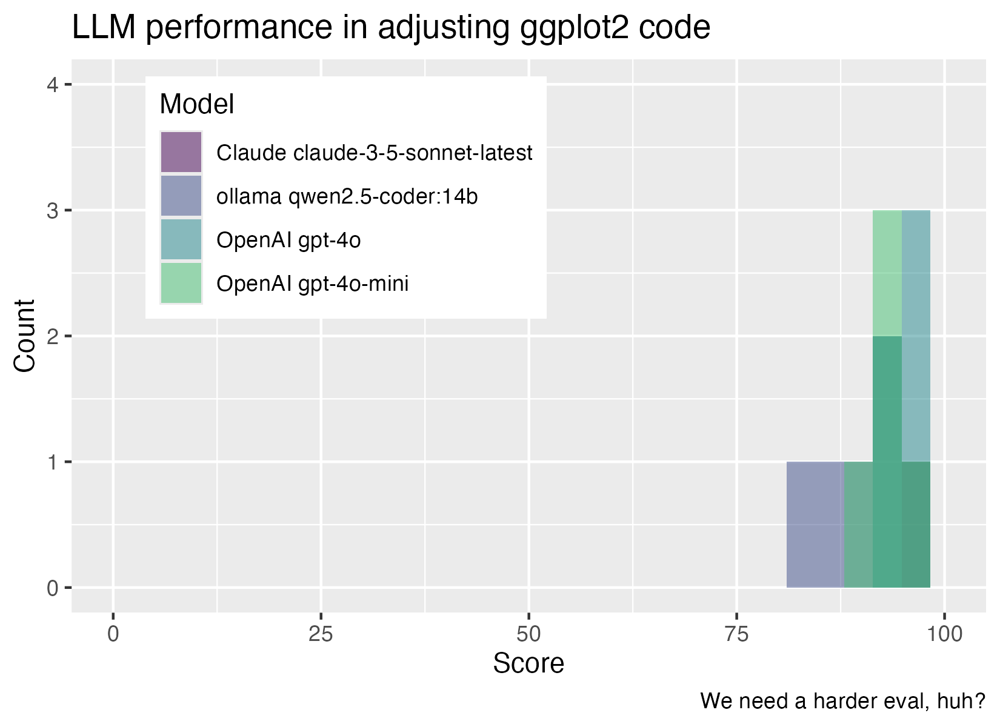

<!-- README.md is generated from README.Rmd. Please edit that file -->

```{r, include = FALSE}
knitr::opts_chunk$set(
  collapse = TRUE,
  comment = "#>",
  fig.path = "man/figures/README-",
  out.width = "100%"
)
```

# evalthat

<!-- badges: start -->
[](https://lifecycle.r-lib.org/articles/stages.html#experimental)
[](https://CRAN.R-project.org/package=evalthat)
<!-- badges: end -->

evalthat provides a testthat-style framework for LLM evaluation in R. If you can write unit tests, you can compare performance across various LLMs, improve your prompts using evidence, and quantify variability in model output.

## Installation

You can install the development version of evalthat like so:

``` r
# install.packages("pak")
pak::pak("simonpcouch/evalthat")
```

## Example

evalthat code looks almost exactly like testthat code. Here's an example:

```r
evaluating(
  model = "claude"
)

test_that("model can make a basic histogram", {
  ch <- elmer::chat_claude()
  input <- input(
    "Write ggplot code to plot a histogram of the mpg variable in mtcars. 
     Return only the plotting code, no backticks and no exposition."
  )
  
  output <- output(ch$chat(input))
  
  # check that output was syntactically code R code
  expect_r_code(output)
  
  # match keywords to affirm intended functionality
  expect_match(output, "ggplot(", fixed = TRUE)
  expect_match(output, "aes(", fixed = TRUE)
  expect_match(output, "geom_histogram(", fixed = TRUE)
  
  # flag output for manual grading
  target <- "ggplot(mtcars) + aes(x = mpg) + geom_histogram()"
  grade_human(input, output, target)
  
  # grade using an LLM---either instantaneously using the current model or
  # flag for later grading with a different model
  grade_model(input, output, target)
})
```

testthat users will notice a couple changes:

* The `evaluating()` function is sort of like `context()`, and logs metadata about the experiment.
* The functions `input()` and `output()` flag "what went into the model?" and "what came out?"
* In addition to the regular `expect_*()` functions from testthat, the package supplies a number of new expectation functions that are helpful in evaluating R code contained in a character string (as it will be when outputted from elmer or its extensions). Those that begin with `expect_*()` are automated, those that begin with `grade_*()` are less-so.

Running the above test file results in a persistent _result file_—think of it like a snapshot. evalthat supplies a number of helpers for working with result files, allowing you to compare performance across various models, iterate on prompts, quantify variability in output, and so on:

```{r, eval = FALSE, include = FALSE}
# quick scratch to generate some example. TODO: make this reproducible
# with `evaluate_file()` and, eventually, transition to `evaluate_across()`.
evaluate_file("tests/evalthat/test-example-cli-pal.R", repeats = 10)

options(
  .pal_fn = "chat_openai",
  .pal_args = list(model = "gpt-4o-mini")
)

evaluate_file("tests/evalthat/test-example-cli-pal.R", repeats = 10)

options(
  .pal_fn = "chat_openai",
  .pal_args = list(model = "gpt-4o")
)

evaluate_file("tests/evalthat/test-example-cli-pal.R", repeats = 10)

library(tidyverse)

plot <- res %>% 
  unnest(evaluating) %>%
  ggplot() +
  aes(x = pct, fill = evaluating) +
  geom_histogram(position = "identity", alpha = .5) +
  xlim(c(0, 100)) +
  labs(
    fill = "Model",
    x = "Score",
    y = "Count",
    title = "LLM performance in translating R erroring code to cli",
    caption = 
      "Claude Sonnet 3.5 and GPT-4o with default elmer settings offer 
       comparable performance on average, though GPT-4o's 'temperature'
       is such that the same input always returns the same response."
  ) +
  scale_fill_viridis_d(end = .7) +
  theme(legend.position = c(0.15, 0.75))

plot

ggsave("inst/ex_plot.png", plot, scale = .7)

```

```{r, echo = FALSE, fig.alt="A ggplot2 histogram, showing distributions of performance on the task 'translating R erroring code to cli' for three different models: Claude 3.5 Sonner, GPT-4o, and GPT-4o-mini. Claude Sonnet 3.5 and GPT-4o with default elmer settings offer comparable performance on average, though GPT-4o's 'temperature' is such that the same input always returns the same response."}

```
