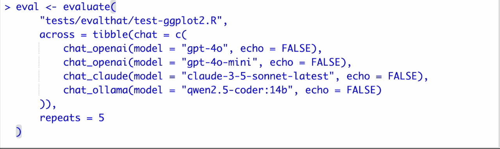

<!-- README.md is generated from README.Rmd. Please edit that file -->

# evalthat

<!-- badges: start -->

[](https://lifecycle.r-lib.org/articles/stages.html#experimental)
[](https://CRAN.R-project.org/package=evalthat)
<!-- badges: end -->

evalthat provides a testthat-style framework for LLM evaluation in R. If
you can write unit tests, you can compare performance across various
LLMs, improve your prompts using evidence, and quantify variability in
model output.

## Installation

You can install the development version of evalthat like so:

``` r
# install.packages("pak")
pak::pak("simonpcouch/evalthat")
```

## Example

evalthat code looks a lot like testthat code. Here’s an example:

``` r
(function(chat) {
  test_that("model can make a basic histogram", {
    input <- input(
      "Write ggplot code to plot a histogram of the mpg variable in mtcars. 
       Return only the plotting code, no backticks and no exposition."
    )
    
    output <- output(chat$chat(input))
    
    # check that output was syntactically code R code
    expect_r_code(output)
    
    # match keywords to affirm intended functionality
    expect_match(output, "ggplot(", fixed = TRUE)
    expect_match(output, "aes(", fixed = TRUE)
    expect_match(output, "geom_histogram(", fixed = TRUE)
    
    # flag output for manual grading
    target <- "ggplot(mtcars) + aes(x = mpg) + geom_histogram()"
    grade_human(input, output, target)
    
    # grade using an LLM---either instantaneously using the current model or
    # flag for later grading with a different model
    grade_model(input, output, target)
  })
})(chat = ellmer::chat_claude())
```

testthat users will notice a couple changes:

- The usual testing file is wrapped in a `function()` and invoked at the
  end of the file with
  `if (exists("chat")) chat else ellmer::chat_claude()`, a shorthand
  that allows for testthat to programatically pass in chats from other
  providers but default to `ellmer::chat_claude()`.
- The functions `input()` and `output()` flag “what went into the
  model?” and “what came out?”
- In addition to the regular `expect_*()` functions from testthat, the
  package supplies a number of new expectation functions that are
  helpful in evaluating R code contained in a character string (as it
  will be when outputted from ellmer or its extensions). Those that
  begin with `expect_*()` are automated, those that begin with
  `grade_*()` are less-so.

Running the above test file results in a persistent *result file*—think
of it like a snapshot. evalthat supplies a number of helpers for working
with result files, allowing you to compare performance across various
models, iterate on prompts, quantify variability in output, and so on.
On the full ggplot2 example file, we could run 5 passes evaluating
several different models for revising ggplot2 code:

``` r
library(ellmer)

temp <- list(temperature = 1)

eval <- evaluate(
  "tests/evalthat/test-ggplot2.R",
  across = tibble(chat = c(
    chat_openai(model = "gpt-4o", api_args = temp, echo = FALSE),
    chat_openai(model = "gpt-4o-mini", api_args = temp, echo = FALSE),
    chat_claude(model = "claude-3-5-sonnet-latest", echo = FALSE))
  ),
  repeats = 5
)
```



Evaluation functions return a data frame with information on the
evaluation results for further analysis:

``` r
eval
#> # A tibble: 15 × 8
#>    model             pct n_fail n_pass timestamp file_hash io           problems
#>    <chr>           <dbl>  <dbl>  <dbl> <chr>     <chr>     <list>       <list>  
#>  1 Claude claude-… 100        0     40 20241206… 6206db86… <named list> <list>  
#>  2 Claude claude-…  95        2     38 20241206… 6206db86… <named list> <list>  
#>  3 Claude claude-… 100        0     40 20241206… 6206db86… <named list> <list>  
#>  4 Claude claude-… 100        0     40 20241206… 6206db86… <named list> <list>  
#>  5 Claude claude-… 100        0     40 20241206… 6206db86… <named list> <list>  
#>  6 OpenAI gpt-4o-…  92.5      3     37 20241206… 6206db86… <named list> <list>  
#>  7 OpenAI gpt-4o-…  97.5      1     39 20241206… 6206db86… <named list> <list>  
#>  8 OpenAI gpt-4o-… 100        0     40 20241206… 6206db86… <named list> <list>  
#>  9 OpenAI gpt-4o-…  97.5      1     39 20241206… 6206db86… <named list> <list>  
#> 10 OpenAI gpt-4o-…  97.5      1     39 20241206… 6206db86… <named list> <list>  
#> 11 OpenAI gpt-4o …  97.5      1     39 20241206… 6206db86… <named list> <list>  
#> 12 OpenAI gpt-4o …  95        2     38 20241206… 6206db86… <named list> <list>  
#> 13 OpenAI gpt-4o …  95        2     38 20241206… 6206db86… <named list> <list>  
#> 14 OpenAI gpt-4o …  95        2     38 20241206… 6206db86… <named list> <list>  
#> 15 OpenAI gpt-4o …  97.5      1     39 20241206… 6206db86… <named list> <list>
```

Visualizing this example output:


